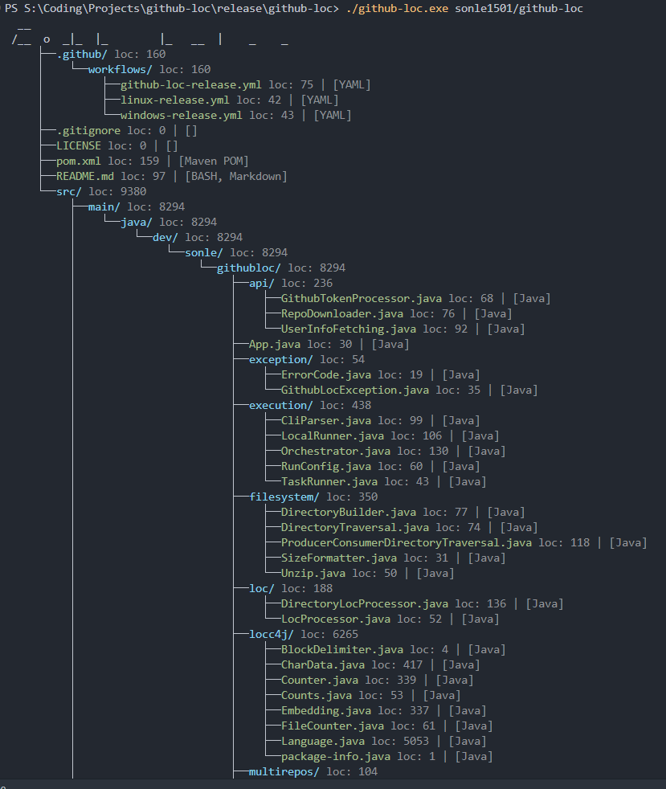

# GitHub LOC Counter

A powerful command-line tool designed to analyze GitHub repositories and local directories, accurately counting Lines of Code (LOC) and visualizing repository structures.

Unlike other online counters (such as `ghloc` or `codetabs`):
- **True SLOC Count**: Instead of just counting text-containing lines (like standard engines), this tool computes actual **Source Lines of Code (SLOC)**, comments, and blank lines.
- **Private & Multiple Repositories**: It fully supports private repositories (using a GitHub token) and analysis of all public repositories for a given user.

---

## 1. Features
- **Accurate Line Counting (SLOC)**: Counts exact Source Lines of Code, comments, and blank lines with high precision using the `locc4j` engine.
- **Repository Tree Visualization**: Generates and prints a directory tree structure directly to the console.
- **Multi-Repository Analysis (User Mode)**: Analyzes and processes all public repositories of a given GitHub user in a single command.
- **File Sorting**: Groups and ranks files by LOC or programming languages.
- **JSON Export**: Export results into JSON files for easy parsing or external use.

### Preview


---

## 2. Usage
There are two main ways to run this application:

1. **Option 1: From Source (Java 17 & Maven)**
   ```bash
   mvn clean package
   java -jar target/githubloc-1.0.jar <command>
   ```
2. **Option 2: Prebuilt Executable (.exe for Windows / binary for Linux)**
   Download the latest archive from the Releases tab on GitHub and run:
   ```bash
   ./github-loc.exe <command>
   ```

For detailed, step-by-step setup and GitHub API token configuration instructions, see the [Setup Guide](docs/setup.md).

---

## 3. Command Guide
Commands follow a simple format: `[TARGET] [ACTION] [SORT]`

### Quick Examples
- **Analyze a single GitHub repository**:
  ```bash
  facebook/react
  ```
- **Analyze all public repositories of a specific user**:
  ```bash
  sonle1501
  ```
- **Sort and group files by programming language**:
  ```bash
  sonle1501/github-loc -a sort BYLANG
  ```

For the complete documentation on modes, action flags (`-a`/`--action`), sorting arguments, and interactive prompt mode, see the [Command Guide](docs/commands.md).

---

## 4. Output Storage
Results and intermediate files are neatly organized in the local `storage/` directory:
- `storage/repos/`: Unzipped repository source folders.
- `storage/zip-repos/`: Raw downloaded repository `.zip` archives.
- `storage/json-results/`: JSON analysis tree outputs and sorted lists.
- `storage/user-repos/`: JSON results of multi-repository analysis.

---

## 5. License
This project utilizes the [locc4j](https://github.com/cthing/locc4j) counting engine.

The `github-loc` project is licensed under the [MIT License](LICENSE).

