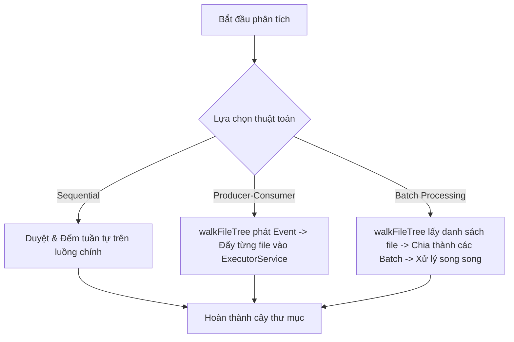

# Tài liệu phát triển phần mềm (Software Development Notes)

## Về tài liệu này
Đây là nhật ký ghi lại các ý tưởng và cách giải quyết các bài toán trong quá trình xây dựng dự án `github-loc`. Đối với các hướng dẫn sử dụng dòng lệnh chi tiết, có thể tham khảo thêm tại tài liệu [commands.md](./commands.md) và hướng dẫn cài đặt tại [setup.md](./setup.md).

---

## Mục tiêu (Goal)

### Công cụ đếm dòng code chính xác (True SLOC)
* **Khác biệt với công cụ online**: Các công cụ trực tuyến phổ biến (như `ghloc` hay `codetabs`) thường chỉ đếm số dòng văn bản thô (bao gồm cả dòng trống và comment). `github-loc` hướng tới việc tính toán chính xác số dòng code thực tế (Source Lines of Code - SLOC), dòng chú thích (Comments), và dòng trống (Blank Lines).
* **Hỗ trợ Kho lưu trữ Bảo mật (Private Repositories)**: Cung cấp cơ chế xác thực an toàn bằng Token để phân tích cả các kho lưu trữ bảo mật của người dùng hoặc tổ chức mà các công cụ trực tuyến không thể tiếp cận.
* **Phân tích hàng loạt (User Mode)**: Cho phép quét và thống kê toàn bộ các kho lưu trữ công khai của một tài khoản GitHub cụ thể chỉ bằng một câu lệnh duy nhất.

### Tại sao lại làm github-loc
* Giúp lập trình viên và người quản lý dự án nhanh chóng đánh giá quy mô, độ phức tạp và cấu trúc của một dự án phần mềm trước hoặc sau khi tải về máy.
* Trực quan hóa cấu trúc thư mục dạng cây trực tiếp trên giao diện dòng lệnh (CLI).
* Phân loại và sắp xếp các file code theo kích thước dòng code hoặc gom nhóm theo ngôn ngữ lập trình, giúp phát hiện các file cồng kềnh hoặc ngôn ngữ chủ đạo trong hệ thống.
* Xuất dữ liệu báo cáo sang định dạng JSON để dễ dàng tích hợp và xử lý bởi các công cụ tự động hóa hoặc phân tích khác.

---

## Kế hoạch triển khai (Plan)

### Proof of Concept - POC
Liệu có thể gọi API của GitHub tải file nén của repo về máy nội bộ rồi giải nén và tiến hành phân tích offline một cách nhanh chóng không?
* **Tải xuống từ GitHub**: Sử dụng HTTP Client để tải xuống file ZIP qua API `/zipball` của GitHub. Cần xử lý vấn đề giới hạn tần suất (Rate Limit) bằng cách nạp mã token cá nhân.
* **Giải nén & Chống Zip Slip**: Giải nén file nén tạm thời xuống thư mục lưu trữ và áp dụng cơ chế kiểm tra đường dẫn chặt chẽ để phòng chống lỗ hổng bảo mật Zip Slip.
* **Đếm dòng code offline**: Sử dụng nhân đếm `locc4j` tích hợp trong mã nguồn để phân tích file mà không cần phụ thuộc vào mạng internet hay thư viện ngoài sau khi tải xong.
* **Xử lý hiệu năng trên repo lớn**: Với các kho lưu trữ lớn (ví dụ: Elasticsearch chứa hàng triệu dòng code), việc duyệt file tuần tự sẽ gây tắc nghẽn nghiêm trọng. Hệ thống cần được thiết kế đa luồng để phân chia công việc xử lý.

---

## Kiến trúc & Công nghệ (Architecture & Tech Stack)

* **Standard Maven Project**: Dự án được tổ chức theo cấu trúc chuẩn của Maven, sử dụng Java 17 làm ngôn ngữ lập trình cốt lõi để tận dụng các tính năng hiện đại (như Record, Pattern Matching...).
* **Động cơ đếm locc4j (Tích hợp)**: Mã nguồn của thư viện `locc4j` được tích hợp trực tiếp vào gói [dev.sonle.githubloc.locc4j](../src/main/java/dev/sonle/githubloc/locc4j) để dễ dàng tùy biến, tối ưu hóa việc phân tích ngôn ngữ và thuận tiện cho việc đóng gói thành file thực thi native (GraalVM) sau này.
* **Jackson (JSON Processor)**: Sử dụng các thư viện `jackson-databind` và `jackson-core` để chuyển đổi cấu trúc cây dữ liệu phức tạp thành định dạng JSON và ghi ra file báo cáo.
* **Logback & SLF4J**: Quản lý log chi tiết trong quá trình tải, giải nén và phân tích, giúp người dùng CLI theo dõi trạng thái vận hành của công cụ mà không bị rối mắt bởi các stack trace lỗi thô.
* **Lombok**: Sử dụng các annotation `@Getter`, `@Setter`, và `@Slf4j` giúp mã nguồn gọn gàng, giảm thiểu các dòng mã lặp đi lặp lại.
* **JUnit 5 & Mockito**: Hệ thống kiểm thử đơn vị (Unit Test) toàn diện bao phủ hầu hết các class xử lý logic quan trọng.

---

## Thiết kế phần mềm (Software Design)

Dưới đây là cách triển khai các tính năng và giải quyết các bài toán kỹ thuật cụ thể:

### 1. Tải dữ liệu repository từ GitHub API (Download Repository)

#### Gửi request đến GitHub API
* Sử dụng `HttpClient` kết hợp với `HttpRequest` trong gói `java.net.http` gửi request GET đến API `/zipball` của GitHub qua [RepoDownloader.java](../src/main/java/dev/sonle/githubloc/api/RepoDownloader.java).
* Cấu hình `.followRedirects(HttpClient.Redirect.ALWAYS)` để tự động xử lý chuyển hướng (HTTP Redirect - 307) từ GitHub API sang máy chủ CDN chứa file zip thực tế.
* Nạp mã token GitHub từ file cấu hình (nếu có) thông qua [GithubTokenProcessor.java](../src/main/java/dev/sonle/githubloc/api/GithubTokenProcessor.java) và đính kèm vào header `Authorization: Bearer <token>` để tăng rate limit và cho phép tải các repository bảo mật.

#### Stream Writing
* Đọc dữ liệu HTTP response dưới dạng luồng dữ liệu stream (`HttpResponse.BodyHandlers.ofInputStream()`).
* Sử dụng `Files.copy` để ghi trực tiếp luồng stream này xuống ổ đĩa vật lý dưới dạng file `.zip` tạm thời tại thư mục `storage/zip-repos/`.
* *Đánh đổi (Trade-offs)*: Việc xử lý ghi dữ liệu bằng Stream thay vì tải toàn bộ file nén vào bộ nhớ RAM giúp ứng dụng hoạt động an toàn, không bị lỗi tràn bộ nhớ `OutOfMemoryError` khi tải xuống các repository có dung lượng lớn hàng trăm megabyte.

---

### 2. Giải nén an toàn & Chống lỗ hổng Zip Slip (Unzip)

* Việc giải nén file ZIP được thực hiện trong [Unzip.java](../src/main/java/dev/sonle/githubloc/filesystem/Unzip.java) bằng cách sử dụng `ZipInputStream` để đọc qua từng `ZipEntry`.
* **Phòng chống lỗ hổng Zip Slip**: Lỗ hổng Zip Slip xảy ra khi một file ZIP chứa các entry có tên dạng `../../malicious.sh` nhằm ghi đè các file hệ thống ngoài thư mục đích. Để ngăn chặn, hệ thống thực hiện giải quyết đường dẫn tuyệt đối bằng `normalize()` và kiểm tra tiền tố đường dẫn:
  ```java
  Path resolvedDestPath = targetDir.resolve(entry.getName()).normalize();
  if (!resolvedDestPath.startsWith(targetDir)) {
      throw new GithubLocException(ErrorCode.FILE_PROCESSING_ERROR, "Entry is outside of the target dir: " + entry.getName());
  }
  ```
* Hệ thống tính toán tổng dung lượng thực tế của toàn bộ các file sau khi giải nén bằng cách cộng dồn kích thước của từng file sau khi ghi xuống đĩa: `repoSizeInBytes += Files.size(resolvedDestPath)`.

---

### 3. Xây dựng cấu trúc cây thư mục (Directory Tree Model)

* Cấu trúc thư mục được mô hình hóa bằng lớp [Tree.java](../src/main/java/dev/sonle/githubloc/tree/Tree.java) và các nút đại diện [FileNode.java](../src/main/java/dev/sonle/githubloc/tree/FileNode.java).
* Mỗi `FileNode` lưu trữ:
  * Thông tin cơ bản: tên file/thư mục, đường dẫn vật lý, nút cha (`parent`) và danh sách các nút con (`childs`).
  * Chỉ số thống kê: số dòng code (`loc`), số dòng bình luận (`comments`), số dòng trống (`blanks`).
  * Bản đồ phân loại ngôn ngữ: tập hợp ngôn ngữ được sử dụng (`languageSet`) và số dòng code tương ứng với từng ngôn ngữ lập trình (`locByLang`).
* **Cơ chế cộng dồn (Roll-up)**: Khi đếm xong LOC cho các file lá (các file thực tế), hệ thống thực hiện hàm đệ quy `countLocFolder` trong [DirectoryLocProcessor.java](../src/main/java/dev/sonle/githubloc/loc/DirectoryLocProcessor.java) để cộng dồn các thông số LOC, Comments, Blanks và gộp (merge) bản đồ ngôn ngữ từ các file con lên các thư mục cha và cuối cùng là thư mục gốc.

---

### 4. Chiến lược duyệt cây thư mục và đếm LOC (Directory Traversal Performance)

Hệ thống hỗ trợ 3 cơ chế duyệt cây thư mục và đếm LOC để phân tích hiệu năng:



1. **Duyệt tuần tự (Sequential Traversal - DirectoryTraversal)**:
   * Đi qua cấu trúc thư mục bằng `Files.walkFileTree`. Khi gặp mỗi file, luồng chính thực hiện gọi trực tiếp `LocProcessor` để phân tích số dòng code.
   * *Đánh giá*: Đơn giản nhưng hiệu năng kém nhất trên các dự án lớn do không tận dụng được đa nhân của CPU.
2. **Mô hình Producer-Consumer đa luồng (ProducerConsumerDirectoryTraversal)**:
   * Luồng chính làm **Producer** thực hiện duyệt file tree (`Files.walkFileTree`). Khi phát hiện ra một file code, nó tạo ra một `FileNode` và đẩy tác vụ phân tích LOC của file đó vào một `ExecutorService` đóng vai trò là **Consumer** với số lượng luồng hoạt động bằng `cores * 4` (ở đây `cores` là số nhân CPU có sẵn).
   * Luồng chính tiếp tục đi qua các thư mục khác mà không cần đợi file trước đó đếm xong. Sau khi hoàn thành việc duyệt đĩa, luồng chính sẽ block bằng `executor.awaitTermination()` để đợi toàn bộ các luồng Consumer hoàn thành.
   * *Đánh giá*: Hiệu năng cải thiện đáng kể trên các dự án trung bình và lớn. Tuy nhiên, nếu repository có quá nhiều file nhỏ, overhead của việc tạo và quản lý quá nhiều task nhỏ trong hàng đợi của ExecutorService có thể làm giảm hiệu suất của JVM.
3. **Duyệt theo lô (Batch Processing - DirectoryBuilder + DirectoryLocProcessor)**:
   * **Bước 1**: Luồng chính duyệt qua cấu trúc đĩa bằng [DirectoryBuilder.java](../src/main/java/dev/sonle/githubloc/filesystem/DirectoryBuilder.java) cực kỳ nhanh vì chỉ xây dựng khung cây thư mục thô (chưa tính LOC) và lưu danh sách toàn bộ các file code vào một `fileList`.
   * **Bước 2**: Sử dụng [DirectoryLocProcessor.java](../src/main/java/dev/sonle/githubloc/loc/DirectoryLocProcessor.java) để chia danh sách file thành các lô (batch) có kích thước bằng số nhân CPU.
   * **Bước 3**: Khởi tạo một `ExecutorService` có `cores * 8` luồng. Mỗi luồng sẽ nhận một batch và xử lý tuần tự việc đếm dòng code cho các file trong batch đó.
   * *Đánh giá*: Đây là phương pháp tối ưu nhất, hạn chế tối đa việc chuyển đổi ngữ cảnh (context switching) của CPU và giảm áp lực lên bộ nhớ.

#### Kết quả đo lường hiệu năng (Benchmark với Elasticsearch ~6M LOC)
| Thuật toán | Điểm số (Thời gian trung bình - ms/op) | Độ tin cậy (Sai số) |
| :--- | :---: | :---: |
| `Sequential` (Tuần tự) | **15530.40 ms** | ± 297.93 ms |
| `Batch Processing` (Chia lô) | **4074.86 ms** | ± 373.23 ms |
| `Producer-Consumer` (Đa luồng) | **3412.35 ms** | ± 110.31 ms |

---

### 5. Quy trình bất đồng bộ & Phân chia luồng xử lý (Asynchronous Workflow & Separated Executor)

Khi người dùng chạy chương trình ở chế độ quét toàn bộ dự án của một User (`Mode.USER`), hệ thống cần tải xuống, giải nén và xử lý song song hàng chục repository khác nhau. Để thực hiện việc này mà không làm treo ứng dụng, [MultithreadingReposHandle.java](../src/main/java/dev/sonle/githubloc/multirepos/MultithreadingReposHandle.java) triển khai pipeline bất đồng bộ sử dụng `CompletableFuture`:

$$\text{Tải xuống (I/O Bound)} \xrightarrow{\text{Async}} \text{Giải nén (I/O Bound)} \xrightarrow{\text{Async}} \text{Đếm LOC (CPU Bound)} \xrightarrow{\text{Async}} \text{Xuất báo cáo JSON (CPU Bound)}$$

#### Phân tách Thread Pool
Để tối ưu hóa tài nguyên phần cứng, hệ thống sử dụng hai loại Thread Pool riêng biệt:
1. **ioExecutor (Cached Thread Pool)**:
   * Sử dụng `Executors.newCachedThreadPool()` cho các tác vụ Tải xuống (`runSingleDownload`) và Giải nén (`runSingleUnzip`).
   * *Lý do*: Tác vụ I/O bound phần lớn thời gian là chờ phản hồi từ mạng hoặc tốc độ đọc/ghi của ổ đĩa. Cached Thread Pool cho phép tạo thêm luồng mới khi cần để thực hiện tải đồng thời nhiều repo, giúp tăng băng thông mạng mà không bị giới hạn cứng.
2. **cpuExecutor (Fixed Thread Pool)**:
   * Sử dụng `Executors.newFixedThreadPool(cores)` với số lượng luồng bằng đúng số nhân CPU cho các tác vụ Xây dựng cây thư mục, Tính toán LOC (`runSingleJsonProcess`).
   * *Lý do*: Tác vụ CPU bound sử dụng hết công suất của nhân CPU để tính toán văn bản. Việc giới hạn số luồng bằng số nhân CPU giúp giảm thiểu tranh chấp lõi CPU, loại bỏ tình trạng quá tải context switching của hệ điều hành.

---

### 6. Tích hợp bộ đếm dòng code (locc4j Engine)

* `github-loc` phân tích cú pháp code trực tiếp thông qua gói [locc4j](../src/main/java/dev/sonle/githubloc/locc4j).
* Lớp [Language.java](../src/main/java/dev/sonle/githubloc/locc4j/Language.java) định nghĩa cấu trúc của hơn 100 ngôn ngữ lập trình phổ biến (tiền tố mở rộng `.java`, `.py`, `.cpp`, `.js`...).
* Lớp [FileCounter.java](../src/main/java/dev/sonle/githubloc/locc4j/FileCounter.java) mở luồng đọc file và sử dụng:
  * [BlockDelimiter.java](../src/main/java/dev/sonle/githubloc/locc4j/BlockDelimiter.java) để xác định ranh giới giữa code và các bình luận khối (ví dụ: `/* ... */` trong C-style, `""" ... """` trong Python).
  * [CharData.java](../src/main/java/dev/sonle/githubloc/locc4j/CharData.java) để phân tích từng ký tự trên một dòng nhằm phân loại dòng đó là dòng code thực thi, dòng comment đơn hay dòng trống.

---

### 7. Cơ chế sắp xếp và thống kê ngôn ngữ (Sorting & Statistics Algorithms)

Sau khi tính toán xong cây thư mục, nếu người dùng chạy hành động `SORT`, [RepoSorter.java](../src/main/java/dev/sonle/githubloc/sort/RepoSorter.java) phối hợp với [FilesSorter.java](../src/main/java/dev/sonle/githubloc/sort/FilesSorter.java) sẽ lọc và xếp hạng dữ liệu:

* **Sắp xếp theo LOC (Hành động SORT mặc định)**: Lọc ra toàn bộ các file lá trong dự án, sắp xếp chúng theo số dòng code giảm dần sử dụng `Comparator` tùy biến.
* **Gom nhóm theo ngôn ngữ (SORT BYLANG)**:
  * Lấy danh sách ngôn ngữ lập trình được sử dụng, sắp xếp các ngôn ngữ này theo tổng số dòng code giảm dần.
  * Phân loại toàn bộ các file code vào từng nhóm ngôn ngữ tương ứng, trong mỗi nhóm các file lại được sắp xếp theo số dòng code giảm dần.
* **Sắp xếp theo ngôn ngữ phổ biến nhất (SORT BYMOSTLANG)**:
  * Xác định ngôn ngữ có tổng số dòng code cao nhất trong toàn bộ repository bằng phương thức `getMostUsedLanguage` trong `DirectoryLocProcessor`.
  * Chỉ lọc ra và sắp xếp các file code thuộc ngôn ngữ phổ biến nhất đó.
* **Tính toán phần trăm sử dụng**: Sử dụng phương thức `getPercentageUsedLanguage` để tính tỷ lệ đóng góp của từng ngôn ngữ trong dự án dựa trên công thức:
  $$\text{Tỷ lệ \%} = \frac{\text{Tổng dòng code của ngôn ngữ}}{\text{Tổng dòng code của cả dự án}} \times 100$$

---

### 8. Quản lý ngoại lệ tập trung (Exception Handling)

* **Custom Exception**: Định nghĩa lớp ngoại lệ [GithubLocException.java](../src/main/java/dev/sonle/githubloc/exception/GithubLocException.java) kế thừa từ `RuntimeException`. Lớp này bọc các thông tin lỗi thô và liên kết với một [ErrorCode.java](../src/main/java/dev/sonle/githubloc/exception/ErrorCode.java) cụ thể.
* **ErrorCode Enum**: Chuẩn hóa toàn bộ các lỗi có thể xảy ra trong hệ thống và định nghĩa mã thoát (Exit Code) tương ứng cho ứng dụng CLI:
  * `INTERRUPTED` (Exit Code 1): Tiến trình bị ngắt giữa chừng.
  * `REPO_DOWNLOAD_FAILED` (Exit Code 2): Tải file zip từ GitHub thất bại.
  * `UNEXPECTED_ERROR` (Exit Code 3): Lỗi không xác định.
  * `INVALID_INPUT` (Exit Code 4): Đối số đầu vào không hợp lệ.
  * `FILE_PROCESSING_ERROR` (Exit Code 5): Lỗi đọc/ghi file hoặc Zip Slip.
  * `REPO_TREE_CREATION_FAILED` (Exit Code 6): Lỗi duyệt thư mục và dựng cây.
  * `GITHUB_API_ERROR` (Exit Code 7): GitHub API trả về mã lỗi đặc biệt (User không tồn tại...).
  * `JSON_PROCESSING_ERROR` (Exit Code 8): Lỗi phân tích cú pháp hoặc ghi file JSON.
* **Fail-Fast & Exit Handler**: Ở phương thức `main` của [App.java](../src/main/java/dev/sonle/githubloc/App.java), toàn bộ ngoại lệ được bắt lại. Chương trình sẽ ghi log mô tả lỗi thân thiện kèm theo mã thoát tương ứng và kết thúc bằng `System.exit(code)`, ngăn chặn việc ném ra stack trace thô gây bối rối cho người sử dụng CLI.

---

### 9. Bảo mật và cấu hình nạp Token (GitHub Token Loader)

* Để tránh việc người dùng phải truyền trực tiếp Personal Access Token qua các tham số dòng lệnh (dễ bị lưu lại trong lịch sử shell của hệ điều hành), [GithubTokenProcessor.java](../src/main/java/dev/sonle/githubloc/api/GithubTokenProcessor.java) cung cấp cơ chế tự động tìm kiếm token theo thứ tự ưu tiên:
  1. **Thư mục làm việc hiện tại (CWD)**: Tìm kiếm file `token.properties` để lấy thuộc tính `FINE_GRAINED_TOKEN`, hoặc file `token.txt` chứa trực tiếp chuỗi token.
  2. **Tài nguyên classpath (Resources)**: Tìm kiếm file `token.properties` được đóng gói sẵn trong ứng dụng tại `src/main/resources/`.
* Các file cấu hình token này đã được thêm vào `.gitignore` của dự án để đảm bảo an toàn bảo mật, tránh rò rỉ token lên các kho lưu trữ công cộng.

---

### 10. Các giải pháp kỹ thuật khác

* **Interactive Mode (Chế độ tương tác)**: Khi khởi chạy ứng dụng mà không truyền bất kỳ đối số nào, [CliParser.java](../src/main/java/dev/sonle/githubloc/execution/CliParser.java) sẽ khởi chạy chế độ tương tác, sử dụng `Scanner` để hướng dẫn người dùng nhập tham số mục tiêu từng bước một cách dễ dàng.
* **Size Formatter**: Tích hợp [SizeFormatter.java](../src/main/java/dev/sonle/githubloc/filesystem/SizeFormatter.java) tự động chuyển đổi kích thước byte thô sang các đơn vị đọc được (B, KB, MB, GB) để hiển thị thông tin tải xuống và giải nén trực quan trên console.
* **Console Tree Rendering**: Sử dụng [TreePrinter.java](../src/main/java/dev/sonle/githubloc/output/TreePrinter.java) để in cấu trúc cây thư mục trực quan trực tiếp ra màn hình dòng lệnh với các ký tự vẽ nhánh chuyên dụng (`├──`, `└──`), kết hợp hiển thị thông tin LOC và ngôn ngữ lập trình của từng file/thư mục.
